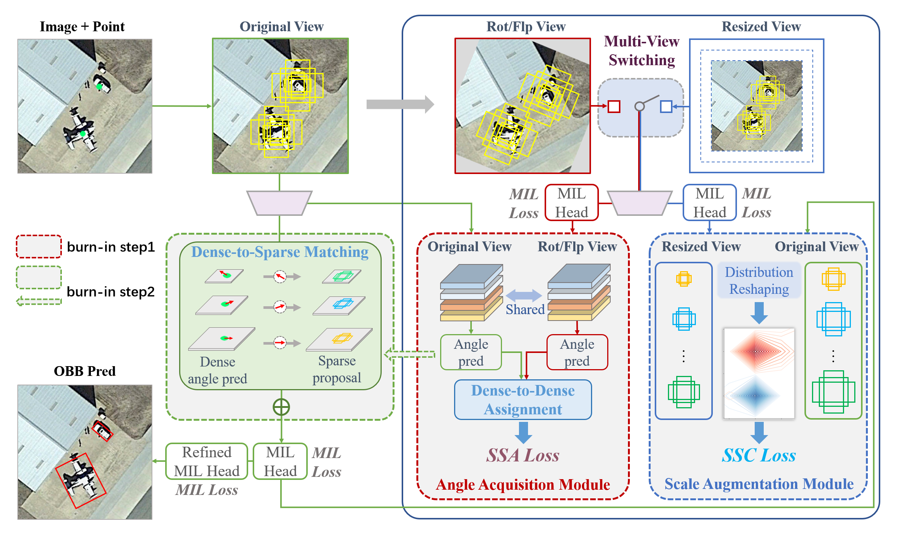

## [CVPR2024] PointOBB: Learning Oriented Object Detection via Single Point Supervision


### Paper
The paper is available at [PointOBB](https://openaccess.thecvf.com/content/CVPR2024/html/Luo_PointOBB_Learning_Oriented_Object_Detection_via_Single_Point_Supervision_CVPR_2024_paper.html). You are also welcome to check out the concurrent work [Point2RBox](https://openaccess.thecvf.com/content/CVPR2024/html/Yu_Point2RBox_Combine_Knowledge_from_Synthetic_Visual_Patterns_for_End-to-end_Oriented_CVPR_2024_paper.html).




### Train/Test
Please see [`PointOBB/README.md`](PointOBB/README.md).


### Weight

DIOR-R

|         Backbone         |  mAP  | Angle |  Config | Detector |                                                                                                                                                                              Download                                                                                                                                                                              |
| :----------------------: | :---: | :---: | :---:  | :------: |  :------------------------------------------------------------------------------------------------------------: |
| ResNet50 (1024,1024,200) | 38.08 | le90  | [pointobb-dior](PointOBB/configs2/pointobb/pointobb_r50_fpn_2x_dior.py)|    Oriented RCNN  |  [model](https://drive.google.com/file/d/11Z4hl6IhvoWhHIVQFpon18BY-SNwq7tD/view?usp=drive_link) |


DOTA-v1.0

|         Backbone         |  mAP  | Angle |  Config | Detector |                                                                                                                                                                              Download                                                                                                                                                                              |
| :----------------------: | :---: | :---: | :-----: | :------: |  :------------------------------------------------------------------------------------------------------------: |
| ResNet50 (1024,1024,200) | 33.31 | le90  | [pointobb-dota](PointOBB/configs2/pointobb/pointobb_r50_fpn_2x_dota10.py)|    Oriented RCNN |  [model](https://drive.google.com/file/d/1muJHHFkiS6UXUpSnE6xzd5h1QNYhO9Hj/view?usp=drive_link) |


### Citation
If you find this work helpful, please consider to cite:
```
@InProceedings{luo2024pointobb,
   title     = {PointOBB: Learning Oriented Object Detection via Single Point Supervision},
   author    = {Luo, Junwei and Yang, Xue and Yu, Yi and Li, Qingyun and Yan, Junchi and Li, Yansheng},
   booktitle = {Proceedings of the IEEE/CVF Conference on Computer Vision and Pattern Recognition},
   pages     = {16730-16740},
   year      = {2024}
}
```
```
@inproceedings{yu2024point2rbox,
   title     = {Point2RBox: Combine Knowledge from Synthetic Visual Patterns for End-to-end Oriented Object Detection with Single Point Supervision},
   author    = {Yi Yu and Xue Yang and Qingyun Li and Feipeng Da and Jifeng Dai and Yu Qiao and Junchi Yan},
   booktitle = {IEEE/CVF Conference on Computer Vision and Pattern Recognition},
   year      = {2024}
}
```

-----

Special thanks to the codebase contributors of MMRotate and P2BNet!
```
@inproceedings{zhou2022mmrotate,
  title   = {MMRotate: A Rotated Object Detection Benchmark using PyTorch},
  author  = {Zhou, Yue and Yang, Xue and Zhang, Gefan and Wang, Jiabao and Liu, Yanyi and
             Hou, Liping and Jiang, Xue and Liu, Xingzhao and Yan, Junchi and Lyu, Chengqi and
             Zhang, Wenwei and Chen, Kai},
  booktitle={Proceedings of the 30th ACM International Conference on Multimedia},
  year={2022}
}
```

```
@inproceedings{P2BNet,
  title     = {Point-to-Box Network for Accurate Object Detection via Single Point Supervision},
  author    = {Pengfei Chen, Xuehui Yu, Xumeng Han, Najmul Hassan, Kai Wang, Jiachen Li, Jian Zhao, Humphrey Shi, Zhenjun Han, and Qixiang Ye},
  booktitle = {ECCV},
  year      = {2022}
}
```
